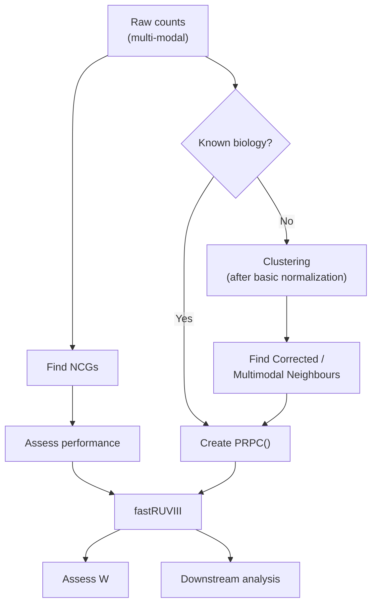

## Installation 

Install the fastRUVIII R package with devtools: 

```r
devtools::install_github('Neal-Liu1/fastRUVIII')
```
### Simple outline of the package

```mermaid
%%{init: {'flowchart': {'htmlLabels': false}}}%%
flowchart TD
  A["Raw counts\n(multi-modal)"]

  A --> B{Known biology?}
  B -->|Yes| P["Create PRPC()"]
  B -->|No| C["Clustering\n(after basic normalization)"]
  C --> N["Find Corrected /\nMultimodal Neighbours"]
  N --> P

  A --> R["Find NCGs"]
  R --> S["Assess performance"]
  S --> F["fastRUVIII"]

  P --> F
  F --> W["Assess W"]
  F --> D["Downstream analysis"]
```

